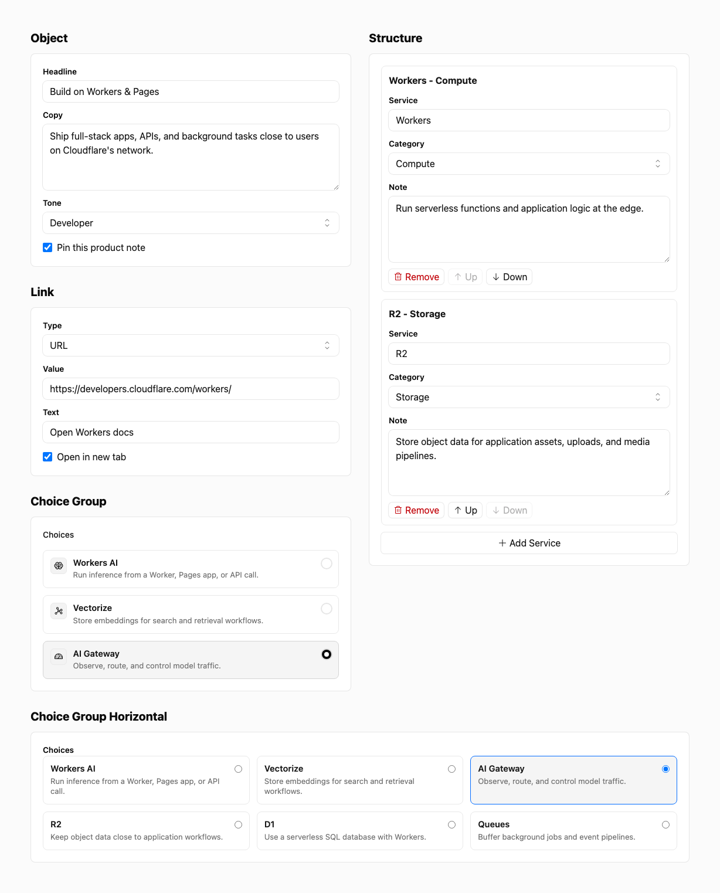

# @bnomei/emdash-fields

[](https://www.npmjs.com/package/@bnomei/emdash-fields)
[](https://www.npmjs.com/package/@bnomei/emdash-fields)
[](https://www.npmjs.com/package/@bnomei/emdash-fields)
[](./package.json)
[](https://github.com/bnomei/emdash-fields)

Structured JSON fields for EmDash.

`@bnomei/emdash-fields` is a native EmDash plugin for JSON-backed
field controls that need a real editor but do not need a full block or layout
builder. It registers reusable object, structure, link, and choices widgets,
stores plain JSON values, and exports TypeScript option/value types for schema
definitions and frontend renderers.

Use it for compact content models such as CTAs, specs, settings, card metadata,
button groups, and link objects. Editors get focused form controls; developers
get predictable JSON without plugin-specific wrappers.

## What It Provides

- Native EmDash plugin factory: `fieldsPlugin()`.
- JSON field widgets: `fields:object`, `fields:structure`, `fields:link`, and
  `fields:choices`.
- Plain JSON stored values without plugin-specific wrappers.
- Admin UI built with [Kumo UI](https://kumo-ui.com/) with full light and dark
  mode support.
- TypeScript helper types such as `LinkValue`, `ObjectOptions`,
  `StructureOptions`, and `ChoicesOptions`.

## Why Use It

EmDash already covers scalar fields, rich text, media, references, and raw JSON.
Fields adds the missing middle layer: structured JSON values with a purpose-built
admin UI.

- Use `object` for one structured object, such as a CTA or settings group.
- Use `structure` for repeatable structured rows, such as specs, links, stats, or
  feature bullets.
- Use `link` for a typed link value with text and target metadata.
- Use `choices` when radio or checkbox-style choices are clearer than a
  select box.
- Use `choices` with `orientation: "horizontal"` and `columns` when choice
  cards should sit side by side and wrap after a fixed count.

For larger page composition, pair it with `@bnomei/emdash-blocks` and
`@bnomei/emdash-bento`.

## Install

```sh
npm install @bnomei/emdash-fields
```

Register the plugin in `astro.config.mjs`:

```js
import emdash from "emdash/astro";
import { fieldsPlugin } from "@bnomei/emdash-fields";

export default {
  integrations: [
    emdash({
      plugins: [fieldsPlugin()],
    }),
  ],
};
```

## Widgets

The plugin currently provides these widgets for `json` fields:

- `fields:object`: a configured object editor.
- `fields:structure`: a repeatable structured data editor.
- `fields:link`: a typed link editor.
- `fields:choices`: radio or checkbox-style option groups.

## Subfield Types

Fields widgets attach to a normal EmDash schema field whose top-level `type` is
`json`. For `object` and `structure` widgets, the nested `options.fields[].type`
value chooses the editor control for that JSON property.

Those nested `type` values use familiar EmDash field-type names for simple
scalar inputs. They only describe the subfield inside the JSON widget; they do
not create nested EmDash schema fields. If omitted, the subfield defaults to
`text`.

Supported subfield types:

| Type       | Editor control                  | Stored value                      |
| ---------- | ------------------------------- | --------------------------------- |
| `text`     | Single-line text input          | String                            |
| `textarea` | Multi-line text area            | String                            |
| `number`   | Number input                    | Number, or `undefined` when empty |
| `integer`  | Number input with integer steps | Number, or `undefined` when empty |
| `boolean`  | Checkbox                        | Boolean                           |
| `select`   | Select menu                     | Selected string value             |
| `url`      | URL input                       | String                            |

Use `select` with `options`, either as strings or `{ "value", "label" }`
objects:

```json
{
  "key": "tone",
  "label": "Tone",
  "type": "select",
  "options": ["Calm", "Bold", "Technical"]
}
```

For richer EmDash field types such as rich text, media, references, or repeaters,
model them as normal EmDash fields or use a block/layout builder instead of
nested Fields subfields.

## Examples

Object field:

```json
{
  "slug": "cta",
  "label": "CTA",
  "type": "json",
  "widget": "fields:object",
  "options": {
    "fields": [
      { "key": "headline", "label": "Headline", "type": "text" },
      { "key": "text", "label": "Text", "type": "textarea" }
    ]
  }
}
```

Link field:

```json
{
  "slug": "primary_link",
  "label": "Primary Link",
  "type": "json",
  "widget": "fields:link"
}
```

Structure field:

```json
{
  "slug": "specs",
  "label": "Specs",
  "type": "json",
  "widget": "fields:structure",
  "options": {
    "itemLabel": "Spec",
    "fields": [
      { "key": "label", "label": "Label", "type": "text" },
      { "key": "value", "label": "Value", "type": "text" }
    ]
  }
}
```

Choices with horizontal cards:

```json
{
  "slug": "demo_mode",
  "label": "Demo mode",
  "type": "json",
  "widget": "fields:choices",
  "options": {
    "orientation": "horizontal",
    "columns": 3,
    "choices": [
      {
        "value": "workers-ai",
        "label": "Workers AI",
        "description": "Run inference from Workers.",
        "icon": "AI"
      },
      {
        "value": "vectorize",
        "label": "Vectorize",
        "description": "Store embeddings for retrieval.",
        "icon": "V"
      },
      {
        "value": "ai-gateway",
        "label": "AI Gateway",
        "description": "Observe and control model traffic.",
        "icon": "AG"
      }
    ]
  }
}
```

### Choice Icons

Choice icons should be either schema-safe strings or code-defined React elements:

- Short plain strings such as `"AI"`, `"V"`, or `"✓"` render as compact text
  tokens. These are the safest choice for JSON, YAML, or other serialized schema
  configuration.
- String image sources render as decorative images when they start with `http:`,
  `https:`, `/`, `./`, `../`, or `data:image/`. Prefer project-owned assets such
  as `/icons/ai.svg` or `./icons/vectorize.svg` when the schema is serialized.
- React icon elements are supported only when choices are defined in TypeScript or
  JavaScript code, for example `icon: <BrainIcon size={16} weight="duotone" />`.
  Do not place JSX, component names, functions, or object literals in serialized
  schema files.

Schema-safe icon examples:

```json
{ "value": "workers-ai", "label": "Workers AI", "icon": "AI" }
{ "value": "vectorize", "label": "Vectorize", "icon": "/icons/vectorize.svg" }
{ "value": "gateway", "label": "AI Gateway", "icon": "./icons/gateway.svg" }
```

Avoid ambiguous or unsafe serialized values such as `"BrainIcon"` when it is meant
to reference a component, raw `<svg>...</svg>` markup, JavaScript expressions, or
non-image `data:` URLs.

## Stored Values

All widgets store plain JSON values. They do not add plugin-specific wrappers, so frontend templates can read the field value directly.

The package exports TypeScript helper types such as `LinkValue`, `ObjectOptions`, `StructureOptions`, `FieldsChoice`, and `ChoicesOptions`.

## Package Surface

- ESM entry: `@bnomei/emdash-fields`.
- Admin entry: `@bnomei/emdash-fields/admin`, including the widget
  components and pure value helpers used by those widgets.
- Type declarations are included from `dist/`.
- Peer dependencies: `emdash` `>=0.17.0`, `react` `^18.0.0 || ^19.0.0`,
  `react-dom` `^18.0.0 || ^19.0.0`, `@cloudflare/kumo` `^2.5.0`, and `@phosphor-icons/react`
  `^2.1.10`.

## Status

This package ships as a native EmDash plugin because the widgets are trusted React admin field widgets. Package exports point at `vp pack`-built `dist/` JavaScript and declarations.

## Related Packages

- `@bnomei/emdash-blocks` provides ordered block-list editing.
- `@bnomei/emdash-bento` provides row and column layout editing
  with nested blocks.

## License

MIT.

## Screenshot


